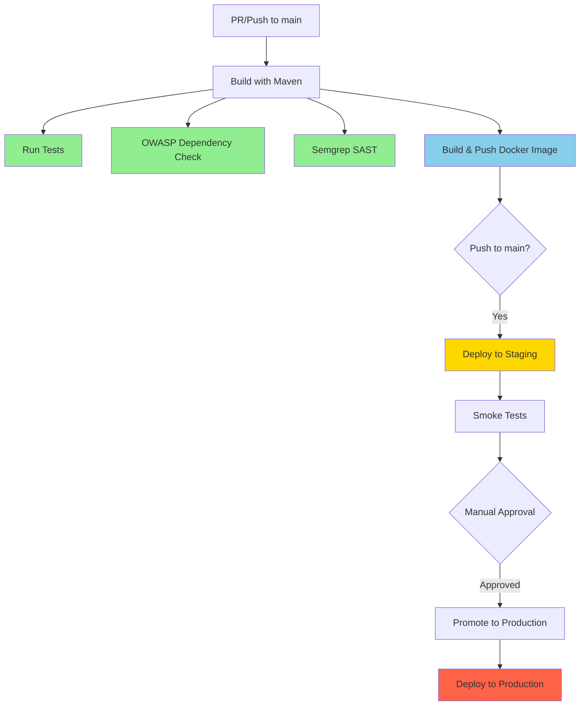

# GitHub Actions CI/CD Workflow Documentation

## Overview

This document describes the CI/CD pipeline for the Payment Application, implemented using GitHub Actions. The workflow automates building, testing, security scanning, and deployment to OpenShift environments.

## Workflow Architecture



## Pipeline Stages

### 1. CI Stage: Continuous Integration

Runs on every pull request and push to main branch.

#### Build Job
- **Purpose**: Compile the Java application
- **Steps**:
  - Checkout code
  - Set up Java 21 (Eclipse Temurin)
  - Build with Maven (`mvn clean package -DskipTests`)
  - Upload JAR artifact for downstream jobs
- **Caching**: Maven dependencies cached for faster builds

#### Test Job
- **Purpose**: Run JUnit integration tests
- **Trigger**: Runs unless commit message contains `[skip checks]`
- **Steps**:
  - Checkout code
  - Set up Java 21
  - Execute tests (`mvn test`)
  - Upload test results (retained for 7 days)
- **Independence**: Runs in parallel with docker-build-push (not a blocker)

#### OWASP Dependency Check Job
- **Purpose**: Scan dependencies for known vulnerabilities
- **Trigger**: Runs unless commit message contains `[skip checks]`
- **Configuration**:
  - Fails on CVSS score >= 7
  - Uses suppression file: `owasp-suppressions.xml`
- **Steps**:
  - Checkout code
  - Set up Java 21
  - Run OWASP Maven plugin
  - Upload HTML report (retained for 7 days)
- **Independence**: Runs in parallel with docker-build-push (not a blocker)

#### Semgrep SAST Scan Job
- **Purpose**: Static application security testing
- **Trigger**: Runs unless commit message contains `[skip checks]`
- **Rulesets**:
  - `p/security-audit`: General security patterns
  - `p/java`: Java-specific vulnerabilities
  - `p/owasp-top-ten`: OWASP Top 10 vulnerabilities
- **Steps**:
  - Checkout code
  - Run Semgrep scan
  - Generate SARIF report
  - Upload to GitHub Security tab
- **Independence**: Runs in parallel with docker-build-push (not a blocker)

#### Docker Build & Push Job
- **Purpose**: Build and push container image to OpenShift registry
- **Dependencies**: Requires `build` job to complete
- **Steps**:
  - Checkout code
  - Download JAR artifact from build job
  - Set up Docker Buildx
  - Login to OpenShift registry using token authentication
  - Build image for `linux/amd64` platform
  - Tag with Git SHA: `bob-demo-staging/payment-app:<git-sha>`
  - Push to OpenShift internal registry
  - Save image name for deployment jobs

**Key Design Decision**: Quality gate jobs (test, OWASP, Semgrep) are NOT in the `needs` array of docker-build-push. This prevents skipped quality gates from blocking the entire pipeline.

### 2. CD Staging: Deploy to bob-demo-staging

Runs automatically after CI passes on push to main branch.

#### Deploy Staging Job
- **Environment**: `staging`
- **Namespace**: `bob-demo-staging`
- **URL**: `https://payment-app-bob-demo-staging.<CLUSTER_DOMAIN>`
- **Steps**:
  1. Checkout code
  2. Download image name artifact
  3. Install OpenShift CLI
  4. Login to OpenShift cluster
  5. Apply Kubernetes manifests with environment substitution
  6. Wait for deployment rollout (5-minute timeout)
  7. Wait for pod readiness (2-minute timeout)
  8. Grace period: 10 seconds for service endpoint propagation
  9. Retrieve route URL dynamically
  10. Run smoke tests

#### Smoke Tests
- **Health Check**: Verify `/actuator/health` endpoint
- **Payment Authorization Test**:
  ```json
  {
    "cardNumber": "4263970000005262",
    "cardExpiry": "12/28",
    "cvv": "123",
    "amount": 100.00
  }
  ```
- **Validation**: Verify response contains `transactionId` and `status` fields

### 3. CD Production: Deploy to bob-demo-prod

Runs after manual approval following successful staging deployment.

#### Deploy Production Job
- **Environment**: `production` (requires manual approval)
- **Namespace**: `bob-demo-prod`
- **URL**: `https://payment-app-bob-demo-prod.<CLUSTER_DOMAIN>`
- **Steps**:
  1. Checkout code
  2. Install OpenShift CLI
  3. Login to OpenShift cluster
  4. **Promote image** from staging to production:
     ```bash
     oc tag bob-demo-staging/payment-app:<git-sha> \
       bob-demo-prod/payment-app:<git-sha>
     ```
  5. Apply Kubernetes manifests with environment substitution
  6. Wait for deployment rollout (5-minute timeout)
  7. Wait for pod readiness (2-minute timeout)
  8. Retrieve production route URL
  9. Verify deployment with health check

**Key Design Decision**: Production NEVER rebuilds the image. It promotes the exact artifact validated in staging using `oc tag`.

## Configuration

### GitHub Secrets

Configure in: **Settings → Secrets and variables → Actions → Secrets**

| Secret Name | Description | Example |
|-------------|-------------|---------|
| `OPENSHIFT_SERVER` | OpenShift API server URL | `https://api.cluster.example.com:6443` |
| `OPENSHIFT_TOKEN` | Service account token with `system:image-pusher` role | `sha256~...` |
| `OPENSHIFT_REGISTRY` | OpenShift internal registry URL | `image-registry.openshift-image-registry.svc:5000` |

### GitHub Variables

Configure in: **Settings → Secrets and variables → Actions → Variables**

| Variable Name | Description | Example |
|---------------|-------------|---------|
| `CLUSTER_DOMAIN` | Cluster domain for route URLs | `apps.cluster.example.com` |

**Note**: Variables are used for non-sensitive configuration like `CLUSTER_DOMAIN` because they're accessible in all workflow contexts including `environment.url`. Secrets are not accessible in environment URLs.

### Environment Variables

Defined in the workflow file:

```yaml
env:
  JAVA_VERSION: '21'
  MAVEN_OPTS: '-Xmx1024m'
  APP_NAME: payment-app
```

## Workflow Triggers

### Pull Request
```yaml
on:
  pull_request:
    branches: [main]
```
- ✅ Build application
- ✅ Run tests (unless `[skip checks]`)
- ✅ Run OWASP scan (unless `[skip checks]`)
- ✅ Run Semgrep scan (unless `[skip checks]`)
- ✅ Build Docker image
- ❌ No deployment

### Push to Main
```yaml
on:
  push:
    branches: [main]
```
- ✅ All CI steps
- ✅ Deploy to staging automatically
- ✅ Run smoke tests
- ⏸️ Wait for manual approval
- ✅ Promote image to production
- ✅ Deploy to production

## Skipping Quality Gates

To skip tests and security scans (e.g., for documentation changes):

```bash
git commit -m "Update README [skip checks]"
git push
```

This will:
- ✅ Run build job
- ✅ Run docker-build-push job
- ❌ Skip test job
- ❌ Skip OWASP dependency check job
- ❌ Skip Semgrep scan job

**Important**: The pipeline will still proceed to deployment because quality gates are not blocking dependencies.

## Prerequisites

### 1. OpenShift Configuration

#### Service Account Setup
```bash
# Create service account
oc create serviceaccount github-actions -n bob-demo-staging
oc create serviceaccount github-actions -n bob-demo-prod

# Grant image-pusher role
oc policy add-role-to-user system:image-pusher \
  system:serviceaccount:bob-demo-staging:github-actions \
  -n bob-demo-staging

oc policy add-role-to-user system:image-pusher \
  system:serviceaccount:bob-demo-prod:github-actions \
  -n bob-demo-prod

# Get token
oc create token github-actions -n bob-demo-staging --duration=8760h
```

#### Registry Configuration
```bash
# Expose internal registry (if not already exposed)
oc patch configs.imageregistry.operator.openshift.io/cluster \
  --type merge \
  -p '{"spec":{"defaultRoute":true}}'

# Get registry URL
oc get route default-route -n openshift-image-registry \
  --template='{{ .spec.host }}'
```

### 2. Kubernetes Manifests

The deployment manifest (`payment-app/k8s/deployment.yaml`) must:

- Define ServiceAccount before Deployment references it
- Use `ScheduleAnyway` for topology constraints in staging
- Configure rolling update strategy with `maxUnavailable: 1`
- Use environment variable substitution for `${NAMESPACE}` and `${IMAGE_TAG}`

Example:
```yaml
apiVersion: apps/v1
kind: Deployment
metadata:
  name: payment-app
  namespace: ${NAMESPACE}
spec:
  replicas: 3
  strategy:
    type: RollingUpdate
    rollingUpdate:
      maxUnavailable: 1
      maxSurge: 1
  template:
    spec:
      containers:
      - name: payment-app
        image: image-registry.openshift-image-registry.svc:5000/${NAMESPACE}/payment-app:${IMAGE_TAG}
```

### 3. OWASP Suppressions (Optional)

Create `payment-app/owasp-suppressions.xml` to suppress false positives:

```xml
<?xml version="1.0" encoding="UTF-8"?>
<suppressions xmlns="https://jeremylong.github.io/DependencyCheck/dependency-suppression.1.3.xsd">
    <suppress>
        <notes>False positive for internal library</notes>
        <cve>CVE-XXXX-XXXXX</cve>
    </suppress>
</suppressions>
```

## Authentication Methods

### Docker Login (Used in Workflow)
```bash
echo "$OPENSHIFT_TOKEN" | docker login "$OPENSHIFT_REGISTRY" \
  --username=unused --password-stdin
```

**Why this method?**
- ✅ Works reliably on GitHub-hosted runners
- ✅ Token-based authentication
- ✅ No dependency on `oc` context
- ✅ Username is ignored (token carries all auth)

### Alternative: oc registry login (Not Used)
```bash
oc registry login
```

**Why not used?**
- ❌ May fail on GitHub-hosted runners
- ❌ Requires active `oc` context
- ❌ Less reliable in CI/CD environments

## Deployment Strategy

### Image Tagging Strategy

1. **CI Stage**: Build and tag with Git SHA
   ```
   bob-demo-staging/payment-app:<git-sha>
   ```

2. **Staging Deployment**: Use the SHA-tagged image
   ```yaml
   image: image-registry.openshift-image-registry.svc:5000/bob-demo-staging/payment-app:<git-sha>
   ```

3. **Production Promotion**: Tag staging image for production
   ```bash
   oc tag bob-demo-staging/payment-app:<git-sha> \
     bob-demo-prod/payment-app:<git-sha>
   ```

4. **Production Deployment**: Use the promoted image
   ```yaml
   image: image-registry.openshift-image-registry.svc:5000/bob-demo-prod/payment-app:<git-sha>
   ```

### Rolling Update Strategy

```yaml
strategy:
  type: RollingUpdate
  rollingUpdate:
    maxUnavailable: 1  # Allow 1 pod to be unavailable during update
    maxSurge: 1        # Allow 1 extra pod during update
```

**Benefits**:
- Zero-downtime deployments
- Gradual rollout with health checks
- Automatic rollback on failure

## Monitoring and Troubleshooting

### View Workflow Runs
1. Navigate to **Actions** tab in GitHub repository
2. Select **CI/CD Pipeline** workflow
3. Click on specific run to view details

### View Job Logs
1. Click on job name (e.g., "Build Application")
2. Expand step to view detailed logs
3. Download logs for offline analysis

### View Artifacts
- Test results: Retained for 7 days
- OWASP reports: Retained for 7 days
- Semgrep SARIF: Uploaded to Security tab

### Common Issues

#### Issue: Docker build fails with "no space left on device"
**Solution**: GitHub-hosted runners have limited disk space. Clean up before build:
```yaml
- name: Free disk space
  run: |
    docker system prune -af
    df -h
```

#### Issue: OpenShift login fails
**Solution**: Verify token and server URL:
```bash
# Test locally
oc login --token="$OPENSHIFT_TOKEN" \
  --server="$OPENSHIFT_SERVER" \
  --insecure-skip-tls-verify=true
```

#### Issue: Image push fails with "unauthorized"
**Solution**: Verify service account has `system:image-pusher` role:
```bash
oc policy who-can create imagestreams -n bob-demo-staging
```

#### Issue: Deployment times out
**Solution**: Check pod events and logs:
```bash
oc get events -n bob-demo-staging --sort-by='.lastTimestamp'
oc logs -l app=payment-app -n bob-demo-staging --tail=100
```

#### Issue: Smoke tests fail
**Solution**: Verify route is accessible and service is ready:
```bash
oc get route payment-app -n bob-demo-staging
oc get pods -l app=payment-app -n bob-demo-staging
curl -v https://payment-app-bob-demo-staging.<CLUSTER_DOMAIN>/actuator/health
```

## Security Considerations

### Secrets Management
- ✅ All sensitive data stored in GitHub Secrets
- ✅ Secrets never logged or exposed in workflow output
- ✅ Token-based authentication (no passwords)
- ✅ Least privilege: Service accounts have minimal required permissions

### Image Security
- ✅ Multi-stage Docker build (smaller attack surface)
- ✅ Distroless base image (no shell, minimal packages)
- ✅ Non-root user (UID 65532)
- ✅ Security context constraints enforced

### Dependency Security
- ✅ OWASP dependency check on every build
- ✅ Semgrep SAST scan for code vulnerabilities
- ✅ SARIF reports uploaded to GitHub Security tab
- ✅ Fail build on CVSS >= 7

### Network Security
- ✅ TLS termination at route level
- ✅ Internal registry communication
- ✅ Service mesh ready (if enabled)

## Performance Optimization

### Caching Strategy
```yaml
- uses: actions/setup-java@v4
  with:
    cache: 'maven'  # Cache Maven dependencies
```

**Benefits**:
- Faster builds (skip dependency downloads)
- Reduced network usage
- Consistent dependency versions

### Parallel Execution
- Quality gates run in parallel with docker-build-push
- Independent jobs maximize runner utilization
- Faster overall pipeline execution

### Artifact Management
```yaml
- uses: actions/upload-artifact@v4
  with:
    retention-days: 1  # Short retention for build artifacts
```

**Benefits**:
- Reduced storage costs
- Faster artifact cleanup
- Only keep what's needed

## Maintenance

### Updating Dependencies

#### Update Java Version
```yaml
env:
  JAVA_VERSION: '21'  # Change to '22' when ready
```

#### Update OpenShift CLI
```yaml
- name: Install OpenShift CLI
  run: |
    curl -LO https://mirror.openshift.com/pub/openshift-v4/clients/ocp/stable/openshift-client-linux.tar.gz
```

#### Update GitHub Actions
```yaml
- uses: actions/checkout@v4  # Update to v5 when available
- uses: actions/setup-java@v4
- uses: actions/upload-artifact@v4
```

### Workflow Versioning

Tag workflow versions for rollback capability:
```bash
git tag -a workflow-v1.0.0 -m "Initial CI/CD workflow"
git push origin workflow-v1.0.0
```

## Best Practices

### Commit Messages
- ✅ Use conventional commits: `feat:`, `fix:`, `docs:`
- ✅ Use `[skip checks]` for documentation-only changes
- ✅ Reference issue numbers: `fixes #123`

### Branch Strategy
- ✅ Feature branches: `feature/payment-validation`
- ✅ Pull requests required for main branch
- ✅ Squash merge to keep history clean

### Deployment Strategy
- ✅ Always deploy to staging first
- ✅ Run smoke tests before production
- ✅ Manual approval for production
- ✅ Never skip staging

### Monitoring
- ✅ Monitor workflow success rate
- ✅ Track deployment frequency
- ✅ Monitor mean time to recovery (MTTR)
- ✅ Review security scan results regularly

## Support

### Documentation
- Workflow file: `.github/workflows/cicd.yml`
- This README: `.github/workflows/README.md`
- Application README: `payment-app/README.md`

### Contacts
- DevOps Team: devops@example.com
- Security Team: security@example.com
- On-call: oncall@example.com

### Resources
- [GitHub Actions Documentation](https://docs.github.com/en/actions)
- [OpenShift Documentation](https://docs.openshift.com/)
- [OWASP Dependency Check](https://owasp.org/www-project-dependency-check/)
- [Semgrep Documentation](https://semgrep.dev/docs/)

---

**Last Updated**: 2026-05-06  
**Workflow Version**: 1.0.0  
**Maintained By**: DevOps Team