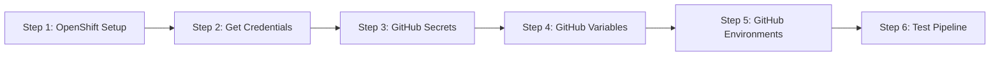

# GitHub Actions CI/CD Setup Guide

This guide walks you through setting up the CI/CD pipeline for the Payment Application step-by-step.

## Prerequisites

Before starting, ensure you have:
- ✅ Access to the OpenShift cluster
- ✅ `oc` CLI installed locally
- ✅ Admin access to the GitHub repository
- ✅ Permissions to create namespaces and service accounts in OpenShift

## Setup Overview



---

## Step 1: OpenShift Cluster Setup

### 1.1 Login to OpenShift

```bash
# Login to your OpenShift cluster
oc login --server=https://api.your-cluster.example.com:6443 --token=your-token

# Verify connection
oc whoami
oc cluster-info
```

**Expected Output:**
```
system:serviceaccount:kube-system:default
https://api.your-cluster.example.com:6443
```

### 1.2 Create Namespaces

```bash
# Create staging namespace
oc new-project bob-demo-staging

# Create production namespace
oc new-project bob-demo-prod

# Verify namespaces
oc get projects | grep bob-demo
```

**Expected Output:**
```
bob-demo-staging   Active
bob-demo-prod      Active
```

### 1.3 Create Service Accounts

```bash
# Create service account in staging
oc create serviceaccount github-actions -n bob-demo-staging

# Create service account in production
oc create serviceaccount github-actions -n bob-demo-prod

# Verify service accounts
oc get sa github-actions -n bob-demo-staging
oc get sa github-actions -n bob-demo-prod
```

**Expected Output:**
```
NAME             SECRETS   AGE
github-actions   1         5s
```

### 1.4 Grant Permissions

The service account needs permissions to:
- Push images to the registry (`system:image-pusher`)
- Deploy applications (`edit` role)

```bash
# Grant image-pusher role in staging
oc policy add-role-to-user system:image-pusher \
  system:serviceaccount:bob-demo-staging:github-actions \
  -n bob-demo-staging

# Grant edit role in staging (for deployments)
oc policy add-role-to-user edit \
  system:serviceaccount:bob-demo-staging:github-actions \
  -n bob-demo-staging

# Grant image-pusher role in production
oc policy add-role-to-user system:image-pusher \
  system:serviceaccount:bob-demo-prod:github-actions \
  -n bob-demo-prod

# Grant edit role in production
oc policy add-role-to-user edit \
  system:serviceaccount:bob-demo-prod:github-actions \
  -n bob-demo-prod

# Allow staging SA to tag images in production namespace
oc policy add-role-to-user system:image-puller \
  system:serviceaccount:bob-demo-staging:github-actions \
  -n bob-demo-prod

oc policy add-role-to-user system:image-pusher \
  system:serviceaccount:bob-demo-staging:github-actions \
  -n bob-demo-prod
```

**Verify Permissions:**
```bash
# Check who can create imagestreams in staging
oc policy who-can create imagestreams -n bob-demo-staging | grep github-actions

# Check who can create deployments in staging
oc policy who-can create deployments -n bob-demo-staging | grep github-actions
```

### 1.5 Expose Internal Registry (if not already exposed)

```bash
# Check if registry route exists
oc get route default-route -n openshift-image-registry

# If not found, expose the registry
oc patch configs.imageregistry.operator.openshift.io/cluster \
  --type merge \
  -p '{"spec":{"defaultRoute":true}}'

# Wait a few seconds for route to be created
sleep 10

# Verify registry route
oc get route default-route -n openshift-image-registry
```

**Expected Output:**
```
NAME            HOST/PORT                                                   PATH   SERVICES         PORT    TERMINATION   WILDCARD
default-route   default-route-openshift-image-registry.apps.cluster.com          image-registry   <all>   reencrypt     None
```

---

## Step 2: Collect Required Credentials and Save to .env

This step collects all required credentials and saves them to a local `.env` file for easy management and reference.

### 2.1 Create Credentials Collection Script

Create a script to collect and save all credentials:

```bash
# Create the script
cat > collect-credentials.sh << 'EOF'
#!/usr/bin/env bash
set -e

echo "🔐 Collecting OpenShift Credentials for GitHub Actions"
echo "======================================================"
echo ""

# Check if .env exists and backup
if [ -f .env ]; then
    echo "⚠️  Backing up existing .env to .env.backup"
    cp .env .env.backup
fi

# Initialize .env file
cat > .env << 'ENVFILE'
# GitHub Actions CI/CD Credentials
# Generated: $(date -u +"%Y-%m-%d %H:%M:%S UTC")
#
# ⚠️  SECURITY WARNING:
# This file contains sensitive credentials. Never commit to Git!
# The .gitignore file should already exclude this file.
#
# These values should be added to GitHub repository:
# Settings → Secrets and variables → Actions

ENVFILE

echo "📍 Step 1: Getting OpenShift Server URL..."
OPENSHIFT_SERVER=$(oc whoami --show-server)
echo "OPENSHIFT_SERVER=${OPENSHIFT_SERVER}" >> .env
echo "   ✅ OPENSHIFT_SERVER=${OPENSHIFT_SERVER}"
echo ""

echo "🔑 Step 2: Creating Service Account Token (valid for 1 year)..."
OPENSHIFT_TOKEN=$(oc create token github-actions -n bob-demo-staging --duration=8760h)
echo "OPENSHIFT_TOKEN=${OPENSHIFT_TOKEN}" >> .env
echo "   ✅ OPENSHIFT_TOKEN=${OPENSHIFT_TOKEN:0:20}... (truncated for security)"
echo ""

echo "🐳 Step 3: Getting Registry URL..."
OPENSHIFT_REGISTRY=$(oc get route default-route -n openshift-image-registry --template='{{ .spec.host }}' 2>/dev/null || echo "image-registry.openshift-image-registry.svc:5000")
echo "OPENSHIFT_REGISTRY=${OPENSHIFT_REGISTRY}" >> .env
echo "   ✅ OPENSHIFT_REGISTRY=${OPENSHIFT_REGISTRY}"
echo ""

echo "🌐 Step 4: Getting Cluster Domain..."
CLUSTER_DOMAIN=$(oc get route -A -o jsonpath='{.items[0].spec.host}' 2>/dev/null | sed 's/^[^.]*\.//' || echo "apps.cluster.example.com")
echo "CLUSTER_DOMAIN=${CLUSTER_DOMAIN}" >> .env
echo "   ✅ CLUSTER_DOMAIN=${CLUSTER_DOMAIN}"
echo ""

echo "======================================================"
echo "✅ Credentials saved to .env file"
echo ""
echo "📋 Next steps:"
echo "   1. Review the .env file: cat .env"
echo "   2. Test credentials: source .env && oc login --token=\"\$OPENSHIFT_TOKEN\" --server=\"\$OPENSHIFT_SERVER\""
echo "   3. Add these values to GitHub Secrets (see Step 3 in SETUP_GUIDE.md)"
echo ""
echo "⚠️  IMPORTANT:"
echo "   - Set calendar reminder to rotate token in 11 months"
echo "   - Never commit .env to Git (already in .gitignore)"
echo "   - Keep this file secure on your local machine"
echo ""
EOF

chmod +x collect-credentials.sh
```

### 2.2 Run the Credentials Collection Script

```bash
# Run the script
./collect-credentials.sh
```

**Expected Output:**
```
🔐 Collecting OpenShift Credentials for GitHub Actions
======================================================

📍 Step 1: Getting OpenShift Server URL...
   ✅ OPENSHIFT_SERVER=https://api.cluster.example.com:6443

🔑 Step 2: Creating Service Account Token (valid for 1 year)...
   ✅ OPENSHIFT_TOKEN=eyJhbGciOiJSUzI1Ni... (truncated for security)

🐳 Step 3: Getting Registry URL...
   ✅ OPENSHIFT_REGISTRY=default-route-openshift-image-registry.apps.cluster.example.com

🌐 Step 4: Getting Cluster Domain...
   ✅ CLUSTER_DOMAIN=apps.cluster.example.com

======================================================
✅ Credentials saved to .env file
```

### 2.3 Review the .env File

```bash
# View the generated .env file
cat .env
```

**Example .env Content:**
```bash
# GitHub Actions CI/CD Credentials
# Generated: 2026-05-06 15:00:00 UTC
#
# ⚠️  SECURITY WARNING:
# This file contains sensitive credentials. Never commit to Git!
# The .gitignore file should already exclude this file.
#
# These values should be added to GitHub repository:
# Settings → Secrets and variables → Actions

OPENSHIFT_SERVER=https://api.cluster.example.com:6443
OPENSHIFT_TOKEN=eyJhbGciOiJSUzI1NiIsImtpZCI6IjRxN...
OPENSHIFT_REGISTRY=default-route-openshift-image-registry.apps.cluster.example.com
CLUSTER_DOMAIN=apps.cluster.example.com
```

### 2.4 Test Credentials from .env

```bash
# Load credentials from .env
source .env

# Test OpenShift login
oc login --token="$OPENSHIFT_TOKEN" \
  --server="$OPENSHIFT_SERVER" \
  --insecure-skip-tls-verify=true

# Verify access to both namespaces
oc get pods -n bob-demo-staging
oc get pods -n bob-demo-prod

# Test registry access (optional)
echo "$OPENSHIFT_TOKEN" | docker login "$OPENSHIFT_REGISTRY" \
  --username=unused --password-stdin
```

**Expected Output:**
```
Logged into "https://api.cluster.example.com:6443" as "system:serviceaccount:bob-demo-staging:github-actions"
Login Succeeded
```

### 2.5 Verify .env is in .gitignore

```bash
# Check if .env is already in .gitignore
grep -q "^\.env$" .gitignore && echo "✅ .env is in .gitignore" || echo "⚠️  Adding .env to .gitignore"

# Add .env to .gitignore if not present
grep -q "^\.env$" .gitignore || echo ".env" >> .gitignore
```

**⚠️ Important Security Notes:**
- The `.env` file contains sensitive credentials
- Never commit `.env` to Git
- Keep the file secure on your local machine
- Set a calendar reminder to rotate the token in 11 months
- The same token works for both namespaces (staging and production)

---

## Step 3: Configure GitHub Secrets

### 3.1 Load Credentials from .env

Before adding secrets to GitHub, load the credentials from your `.env` file:

```bash
# Load credentials
source .env

# Display values (for verification before adding to GitHub)
echo "OPENSHIFT_SERVER: $OPENSHIFT_SERVER"
echo "OPENSHIFT_TOKEN: ${OPENSHIFT_TOKEN:0:20}... (truncated)"
echo "OPENSHIFT_REGISTRY: $OPENSHIFT_REGISTRY"
```

### 3.2 Navigate to Repository Settings

1. Go to your GitHub repository: `https://github.com/jpradier/bob-sdlc`
2. Click **Settings** tab
3. In the left sidebar, click **Secrets and variables** → **Actions**
4. Click **Secrets** tab

### 3.3 Add Secrets from .env

Click **New repository secret** for each of the following. Copy values from your `.env` file:

#### Secret 1: OPENSHIFT_SERVER
- **Name:** `OPENSHIFT_SERVER`
- **Value:** Copy from `.env` or run: `source .env && echo $OPENSHIFT_SERVER`
- Click **Add secret**

#### Secret 2: OPENSHIFT_TOKEN
- **Name:** `OPENSHIFT_TOKEN`
- **Value:** Copy from `.env` or run: `source .env && echo $OPENSHIFT_TOKEN`
- Click **Add secret**

#### Secret 3: OPENSHIFT_REGISTRY
- **Name:** `OPENSHIFT_REGISTRY`
- **Value:** Copy from `.env` or run: `source .env && echo $OPENSHIFT_REGISTRY`
- Click **Add secret**

**💡 Tip:** You can copy values directly from terminal:
```bash
# Copy OPENSHIFT_SERVER to clipboard (macOS)
source .env && echo $OPENSHIFT_SERVER | pbcopy

# Copy OPENSHIFT_TOKEN to clipboard (macOS)
source .env && echo $OPENSHIFT_TOKEN | pbcopy

# Copy OPENSHIFT_REGISTRY to clipboard (macOS)
source .env && echo $OPENSHIFT_REGISTRY | pbcopy
```

### 3.4 Verify Secrets

You should see three secrets listed:
- ✅ `OPENSHIFT_SERVER`
- ✅ `OPENSHIFT_TOKEN`
- ✅ `OPENSHIFT_REGISTRY`

**Note:** You cannot view secret values after creation (security feature).

---

## Step 4: Configure GitHub Variables

### 4.1 Load CLUSTER_DOMAIN from .env

```bash
# Load and display CLUSTER_DOMAIN
source .env && echo "CLUSTER_DOMAIN: $CLUSTER_DOMAIN"
```

### 4.2 Navigate to Variables Tab

1. In **Settings** → **Secrets and variables** → **Actions**
2. Click **Variables** tab

### 4.3 Add Variable from .env

Click **New repository variable**:

#### Variable: CLUSTER_DOMAIN
- **Name:** `CLUSTER_DOMAIN`
- **Value:** Copy from `.env` or run: `source .env && echo $CLUSTER_DOMAIN`
- Click **Add variable**

**💡 Tip:** Copy to clipboard (macOS):
```bash
source .env && echo $CLUSTER_DOMAIN | pbcopy
```

### 4.4 Verify Variable

You should see:
- ✅ `CLUSTER_DOMAIN` = `apps.cluster.example.com`

**Note:** Variables are visible (not encrypted) because they're non-sensitive configuration.

---

## Step 5: Configure GitHub Environments

GitHub Environments enable deployment protection rules and manual approvals.

### 5.1 Navigate to Environments

1. Go to **Settings** → **Environments**
2. You should see an empty list or existing environments

### 5.2 Create Staging Environment

1. Click **New environment**
2. **Name:** `staging`
3. Click **Configure environment**
4. **Deployment protection rules:**
   - ❌ Do NOT enable "Required reviewers" (auto-deploy)
   - ❌ Do NOT enable "Wait timer"
5. **Environment secrets:** (leave empty - uses repository secrets)
6. Click **Save protection rules**

### 5.3 Create Production Environment

1. Click **New environment**
2. **Name:** `production`
3. Click **Configure environment**
4. **Deployment protection rules:**
   - ✅ Enable "Required reviewers"
   - Add yourself and/or team members as reviewers
   - Set **Required number of reviewers:** `1` (or more for additional safety)
   - ❌ Do NOT enable "Wait timer" (unless you want a delay)
5. **Environment secrets:** (leave empty - uses repository secrets)
6. Click **Save protection rules**

### 5.4 Verify Environments

You should see two environments:
- ✅ `staging` (no protection rules)
- ✅ `production` (requires approval from reviewers)

---

## Step 6: Test the Pipeline

### 6.1 Trigger the Workflow

Create a test commit to trigger the pipeline:

```bash
# Make a small change
echo "# CI/CD Pipeline Active" >> README.md

# Commit and push
git add README.md
git commit -m "test: Trigger CI/CD pipeline"
git push origin main
```

### 6.2 Monitor Workflow Execution

1. Go to **Actions** tab in GitHub
2. Click on the latest workflow run: "CI/CD Pipeline"
3. Watch the jobs execute in real-time

**Expected Job Sequence:**

```
1. ✅ Build Application (1-2 minutes)
2. ✅ Run Tests (1-2 minutes) - parallel
3. ✅ OWASP Dependency Check (2-3 minutes) - parallel
4. ✅ Semgrep SAST Scan (1 minute) - parallel
5. ✅ Build and Push Docker Image (3-5 minutes)
6. ✅ Deploy to Staging (2-3 minutes)
7. ⏸️ Deploy to Production (waiting for approval)
```

### 6.3 Review Staging Deployment

After staging deployment completes:

```bash
# Check staging deployment
oc get pods -n bob-demo-staging

# Check staging route
oc get route payment-app -n bob-demo-staging

# Get staging URL
STAGING_URL=$(oc get route payment-app -n bob-demo-staging -o jsonpath='{.spec.host}')
echo "Staging URL: https://${STAGING_URL}"

# Test staging endpoint
curl -k "https://${STAGING_URL}/actuator/health"
```

**Expected Output:**
```json
{"status":"UP"}
```

### 6.4 Approve Production Deployment

1. In the GitHub Actions workflow run, you'll see:
   ```
   Deploy to Production
   Review required
   ```
2. Click **Review deployments**
3. Select **production** environment
4. Add a comment (optional): "Approved for production deployment"
5. Click **Approve and deploy**

### 6.5 Verify Production Deployment

After production deployment completes:

```bash
# Check production deployment
oc get pods -n bob-demo-prod

# Check production route
oc get route payment-app -n bob-demo-prod

# Get production URL
PROD_URL=$(oc get route payment-app -n bob-demo-prod -o jsonpath='{.spec.host}')
echo "Production URL: https://${PROD_URL}"

# Test production endpoint
curl -k "https://${PROD_URL}/actuator/health"
```

**Expected Output:**
```json
{"status":"UP"}
```

### 6.6 Verify Image Promotion

Confirm that production is using the same image as staging:

```bash
# Get staging image
oc get deployment payment-app -n bob-demo-staging \
  -o jsonpath='{.spec.template.spec.containers[0].image}'

# Get production image
oc get deployment payment-app -n bob-demo-prod \
  -o jsonpath='{.spec.template.spec.containers[0].image}'
```

**Both should show the same Git SHA tag:**
```
image-registry.openshift-image-registry.svc:5000/bob-demo-staging/payment-app:976f0b2...
image-registry.openshift-image-registry.svc:5000/bob-demo-prod/payment-app:976f0b2...
```

---

## Step 7: Test Quality Gate Skipping

### 7.1 Skip Checks for Documentation Changes

```bash
# Make a documentation change
echo "Updated documentation" >> .github/workflows/README.md

# Commit with [skip checks] flag
git add .github/workflows/README.md
git commit -m "docs: Update workflow documentation [skip checks]"
git push origin main
```

### 7.2 Verify Skipped Jobs

In GitHub Actions, you should see:
- ✅ Build Application (runs)
- ⏭️ Run Tests (skipped)
- ⏭️ OWASP Dependency Check (skipped)
- ⏭️ Semgrep SAST Scan (skipped)
- ✅ Build and Push Docker Image (runs)
- ✅ Deploy to Staging (runs)

---

## Troubleshooting

### Issue: "Failed to login to OpenShift registry"

**Symptoms:**
```
Error: unauthorized: authentication required
```

**Solutions:**

1. **Verify token is valid:**
   ```bash
   oc login --token="$OPENSHIFT_TOKEN" --server="$OPENSHIFT_SERVER"
   oc whoami
   ```

2. **Check service account permissions:**
   ```bash
   oc policy who-can create imagestreams -n bob-demo-staging
   ```

3. **Regenerate token:**
   ```bash
   oc create token github-actions -n bob-demo-staging --duration=8760h
   ```
   Update the `OPENSHIFT_TOKEN` secret in GitHub.

### Issue: "Deployment failed or timed out"

**Symptoms:**
```
error: timed out waiting for the condition
```

**Solutions:**

1. **Check pod status:**
   ```bash
   oc get pods -n bob-demo-staging
   oc describe pod <pod-name> -n bob-demo-staging
   ```

2. **Check pod logs:**
   ```bash
   oc logs -l app=payment-app -n bob-demo-staging --tail=100
   ```

3. **Check events:**
   ```bash
   oc get events -n bob-demo-staging --sort-by='.lastTimestamp' | tail -20
   ```

4. **Common causes:**
   - Image pull errors (check registry authentication)
   - Resource limits (check node capacity)
   - Health check failures (check application logs)

### Issue: "Smoke tests failed"

**Symptoms:**
```
curl: (7) Failed to connect to payment-app-bob-demo-staging
```

**Solutions:**

1. **Verify route exists:**
   ```bash
   oc get route payment-app -n bob-demo-staging
   ```

2. **Check service endpoints:**
   ```bash
   oc get endpoints payment-app -n bob-demo-staging
   ```

3. **Test route locally:**
   ```bash
   ROUTE=$(oc get route payment-app -n bob-demo-staging -o jsonpath='{.spec.host}')
   curl -v -k "https://${ROUTE}/actuator/health"
   ```

4. **Check pod readiness:**
   ```bash
   oc get pods -l app=payment-app -n bob-demo-staging
   ```

### Issue: "OWASP dependency check fails"

**Symptoms:**
```
One or more dependencies were identified with vulnerabilities that have a CVSS score greater than or equal to '7.0'
```

**Solutions:**

1. **Review the report:**
   - Download the artifact from GitHub Actions
   - Open `dependency-check-report.html`
   - Review each vulnerability

2. **Create suppression file:**
   ```bash
   cat > payment-app/owasp-suppressions.xml << 'EOF'
   <?xml version="1.0" encoding="UTF-8"?>
   <suppressions xmlns="https://jeremylong.github.io/DependencyCheck/dependency-suppression.1.3.xsd">
       <suppress>
           <notes>False positive - not applicable to our use case</notes>
           <cve>CVE-2024-XXXXX</cve>
       </suppress>
   </suppressions>
   EOF
   ```

3. **Update dependencies:**
   ```bash
   cd payment-app
   mvn versions:display-dependency-updates
   mvn versions:use-latest-releases
   ```

### Issue: "Semgrep scan fails"

**Symptoms:**
```
Semgrep found security issues
```

**Solutions:**

1. **Review findings in GitHub Security tab:**
   - Go to **Security** → **Code scanning alerts**
   - Review each Semgrep finding

2. **Fix legitimate issues:**
   - Address security vulnerabilities in code
   - Commit fixes and re-run pipeline

3. **Suppress false positives:**
   Create `.semgrepignore` file:
   ```
   # Ignore test files
   **/test/**
   
   # Ignore generated code
   **/target/**
   ```

---

## Maintenance

### Rotating Service Account Token

Tokens expire after 1 year. Set a reminder to rotate:

```bash
# Generate new token (11 months from now)
oc create token github-actions -n bob-demo-staging --duration=8760h

# Update GitHub secret
# Go to Settings → Secrets → OPENSHIFT_TOKEN → Update
```

### Updating Workflow

To update the workflow:

```bash
# Edit workflow file
vim .github/workflows/cicd.yml

# Commit changes
git add .github/workflows/cicd.yml
git commit -m "feat: Update CI/CD workflow"
git push origin main
```

### Monitoring Pipeline Health

Track these metrics:
- ✅ Success rate (target: >95%)
- ⏱️ Pipeline duration (target: <15 minutes)
- 🔄 Deployment frequency (track trends)
- 🚨 Failed deployments (investigate immediately)

---

## Security Best Practices

### ✅ Do's
- ✅ Rotate tokens annually
- ✅ Use least privilege permissions
- ✅ Review security scan results
- ✅ Require manual approval for production
- ✅ Monitor workflow logs for anomalies

### ❌ Don'ts
- ❌ Never commit secrets to Git
- ❌ Never share tokens in chat/email
- ❌ Never skip security scans in production
- ❌ Never deploy to production without staging validation
- ❌ Never use the same token for multiple clusters

---

## Next Steps

After completing this setup:

1. ✅ **Test the full pipeline** with a real code change
2. ✅ **Set up monitoring** for deployment notifications
3. ✅ **Configure branch protection** rules on main branch
4. ✅ **Set up calendar reminder** for token rotation
5. ✅ **Document team runbook** for incident response
6. ✅ **Train team members** on approval process

---

## Support

If you encounter issues not covered in this guide:

1. **Check workflow logs** in GitHub Actions
2. **Check OpenShift logs** with `oc logs`
3. **Review documentation** in `.github/workflows/README.md`
4. **Contact DevOps team** for assistance

---

**Setup Guide Version:** 1.0.0  
**Last Updated:** 2026-05-06  
**Maintained By:** DevOps Team