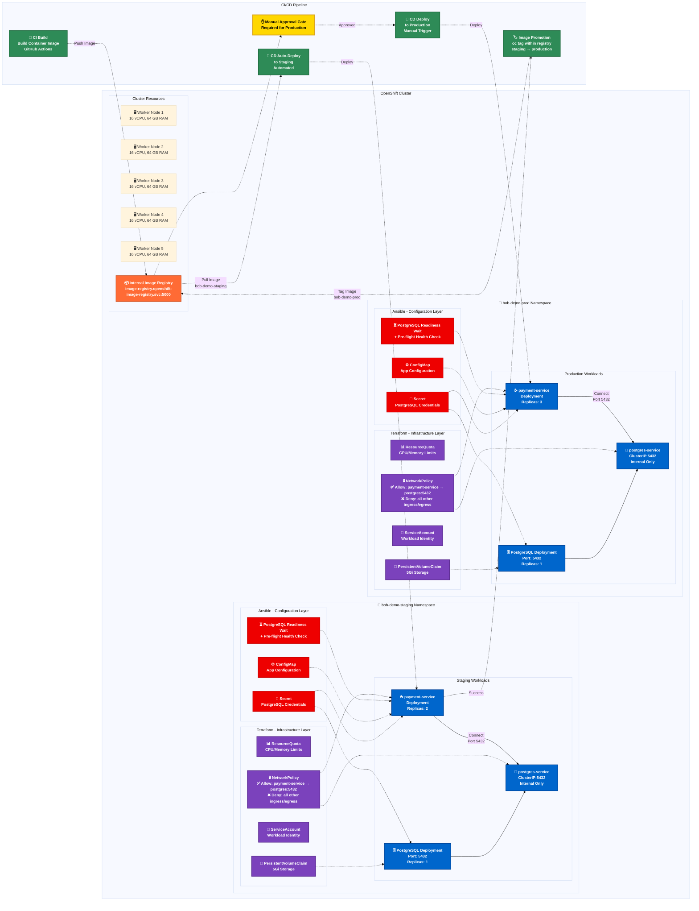

# Payment Application Infrastructure and Deployment Architecture

This diagram illustrates the complete infrastructure setup and CI/CD deployment flow for the payment application on OpenShift.

## Architecture Overview

### Infrastructure Layer (Terraform)

**Cluster Configuration:**
- Single OpenShift cluster with 5 worker nodes
- Each worker node: 16 vCPU, 64 GB RAM
- Two namespaces: `bob-demo-staging` and `bob-demo-prod`

**Per Namespace Resources:**
- **ResourceQuota**: Limits resource consumption
- **NetworkPolicy**: 
  - Allows: `payment-service` → `postgres-service` on port 5432
  - Denies: All other ingress/egress by default
- **ServiceAccount**: Identity for workloads
- **PostgreSQL**:
  - Deployment with ClusterIP Service (port 5432, internal only)
  - PersistentVolumeClaim (5Gi) for data persistence

### Configuration Layer (Ansible)

**Per Namespace Configuration:**
- **Secret**: PostgreSQL credentials injection
- **ConfigMap**: Application configuration
- **Readiness Wait**: PostgreSQL readiness check before pre-flight health check

### CI/CD and Deployment Flow

1. **CI Build**: Builds container image from source code
2. **Image Push**: Pushes image to OpenShift internal registry (`image-registry.openshift-image-registry.svc:5000`)
3. **Auto-Deploy to Staging**: CD pipeline automatically deploys to `bob-demo-staging`
4. **Staging Validation**: `payment-service` connects to `postgres-service` in staging namespace
5. **Image Promotion**: Image promoted via `oc tag` within internal registry to `bob-demo-prod`
6. **Manual Approval**: Production deployment requires manual approval gate
7. **Production Deployment**: CD pipeline deploys to `bob-demo-prod`
8. **Production Runtime**: `payment-service` connects to its own `postgres-service` in production namespace

### Network Isolation

Each namespace maintains complete network isolation:
- Payment service can only communicate with PostgreSQL within the same namespace
- PostgreSQL services are internal-only (ClusterIP)
- NetworkPolicy enforces strict ingress/egress rules
- No cross-namespace communication allowed

### Image Registry Flow

- **Internal Registry**: `image-registry.openshift-image-registry.svc:5000`
- **Staging Image**: `bob-demo-staging/payment-service:latest`
- **Production Image**: Promoted via `oc tag` from staging to `bob-demo-prod/payment-service:latest`
- No external registry dependencies
